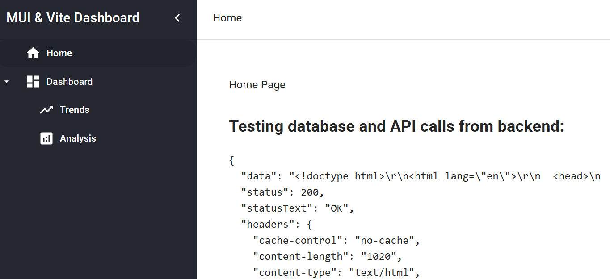

# React Material UI & Vite.js Website Template

Application template developed with Node.js, React Material UI & Vite.js, PostgreSQL, and Docker

## How to run

1. Clone the repository
2. Ensure Node.js and Docker Desktop are installed on your machine
3. In the terminal, run the command `docker-compose up --build`

### Dev notes
- Auto-refresh is enabled for backend code changes. If auto-refresh is taxing on CPU, adjust backend/package.json/scripts/dev to the following: `"dev": "nodemon index.js"`
- Use the command `docker-compose down -v` to reinstall dependencies

### Preview

